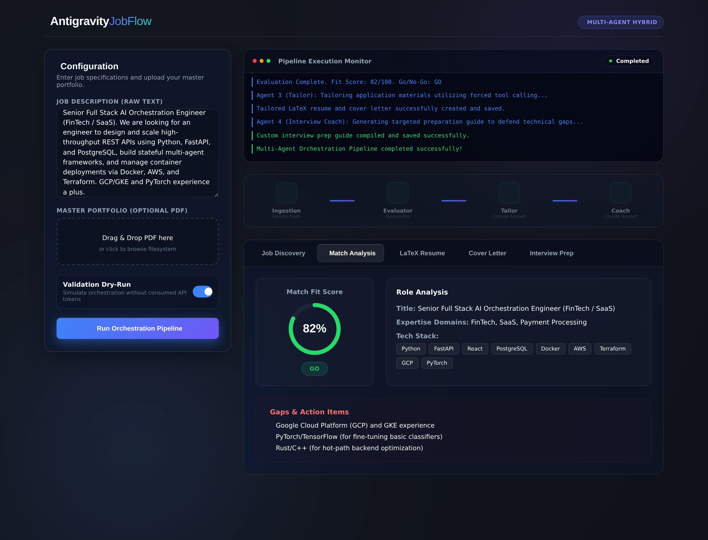
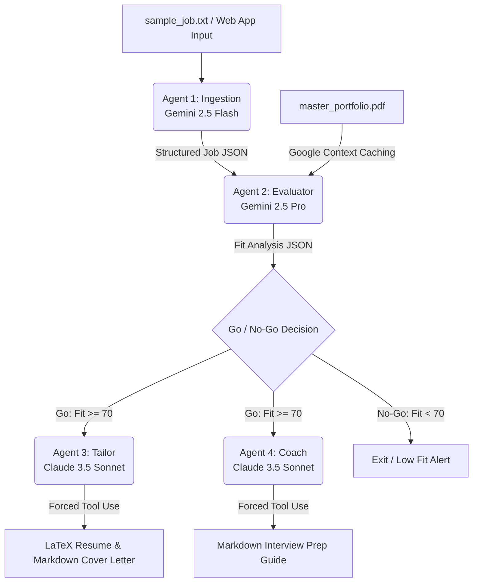

# Hybrid Multi-Agent Job Search Pipeline

[](https://github.com/akarlin3/agenticjob/actions/workflows/ci.yml)
[](LICENSE)

A production-ready, highly modular orchestration pipeline in Python that evaluates job descriptions against a master portfolio PDF and generates tailored job application materials.

The pipeline combines the strengths of **Google GenAI** (Gemini 2.5) and **Anthropic** (Claude 3.5 Sonnet) models, implementing advanced patterns like **Structured JSON Outputs**, **Forced Tool Use**, and **Stateful Context Caching** to ensure a reliable and highly tailored application package.

---

## Web Application Interface (Midnight Glass Theme)

This system comes with an interactive, fully functional **Single Page Web Application** featuring:
- **Responsive Layout**: Designed using a curated modern glassmorphism aesthetic with custom HSL styling and glow orbs.
- **Drag-and-Drop PDF Upload**: Interactively upload your latest `master_portfolio.pdf` directly from the browser.
- **Real-Time Log Monitor**: Logs and agent-node transitions are streamed live from the backend over Server-Sent Events (`POST /api/run/stream`) — what you see in the console mirrors what the pipeline is doing at that moment, not a post-hoc replay.
- **Dynamic Dashboard**: Includes an animated matching gauge, fit scores, and critical gap breakdowns.
- **Side-by-Side Previews**: View the customized LaTeX resume source, full cover letter markdown, and coach strategy cards side-by-side with instant clipboard copies and file download links.
- **One-Click PDF Download**: When Tectonic is available on the host (it is, in the bundled Docker image), the tailored LaTeX resume is server-side-compiled to PDF and exposed via `GET /api/download/resume-pdf` alongside the `.tex` source.



> _Screenshot captured running the pipeline in `--mock` mode (no API keys), using the
> bundled synthetic sample portfolio._

### Running the demo locally
There is no hosted demo — the live pipeline makes billable Gemini + Anthropic API
calls. To try the web UI yourself, run it locally (it boots in mock mode with no
keys required):
```bash
python3 -m uvicorn app:app --port 8000 --reload
```
Then open **http://localhost:8000** in your browser. Leave the **Validation Dry-Run**
toggle on to run fully offline with the synthetic sample data.

---

## Architecture Diagram



---

## Key Features

1. **Structured Ingestion (Agent 1 - Gemini 2.5 Flash)**: Parses messy, raw job descriptions into a highly defined Pydantic JSON schema (`role_title`, `required_tech_stack`, `core_responsibilities`, `domain_expertise`).
2. **Context Caching (Agent 2 - Gemini 2.5 Pro)**: Uploads the static `master_portfolio.pdf` to the Google Files API and creates a reusable, explicit Context Cache (`ttl=3600s`). For multiple evaluations, the pipeline lists active caches and dynamically reuses the existing cached content, slashing latency and tokens.
3. **Pydantic Structured Matches**: Enforces a strict schema validation on the fit score, technical gaps, and go/no-go decisions.
4. **Forced Tool Use (Agent 3 & 4 - Claude 3.5 Sonnet)**: Leverages Anthropic's tool-calling protocol, forcing Claude to invoke targeted generation schemas (`generate_application_materials` and `output_interview_prep`). This guarantees 100% structured responses without conversational preamble.
5. **Robust Mock/Validation Mode**: Includes a `--mock` option allowing full, end-to-end local integration testing, schema checks, and workspace file writes without billing active API keys.

---

## Directory Structure

```
├── .env                     # API Credentials (ignored by git)
├── requirements.txt         # Project dependencies
├── requirements-dev.txt     # Dev/test dependencies (pytest, httpx)
├── sample_data.py           # Synthetic demo persona (single source of truth)
├── create_portfolio.py      # Generates master_portfolio.pdf with ReportLab
├── master_portfolio.pdf     # The master resume/portfolio compiled dynamically
├── sample_job.txt           # Sample target job description
├── ingestion.py             # Agent 1 (Gemini 2.5 Flash Ingestion)
├── evaluator.py             # Agent 2 (Gemini 2.5 Pro Evaluation + Context Caching)
├── tailor.py                # Agent 3 (Claude 3.5 Sonnet forced-tool Tailoring)
├── coach.py                 # Agent 4 (Claude 3.5 Sonnet forced-tool Interview Prep)
├── main.py                  # Pipeline Orchestrator (CLI)
├── app.py                   # FastAPI Backend Server (serves Web UI)
├── static/                  # Single Page Web App Assets
│   ├── index.html           # Web UI layout
│   ├── style.css            # Midnight Glass design stylesheet
│   └── app.js               # Reactive frontend logic, animations, and API calls
├── tests/                   # Offline unit tests (pytest, mock mode)
├── docs/media/              # README screenshots
├── output/                  # Generated tailored artifacts
│   ├── job_analysis.json    # Ingested job specifications
│   ├── fit_evaluation.json  # Go/no-go fit score and gap analysis
│   ├── tailored_resume.tex  # Custom tailored LaTeX resume
│   ├── cover_letter.md      # Persuasive, tailored cover letter
│   └── interview_prep.md    # Custom behavioral & technical interview prep guide
└── README.md                # System documentation
```

---

## Quick Start Setup

### 1. Clone & Set Up Directory
Ensure you are running Python 3.9+ (or newer) inside the project workspace directory:
```bash
# Verify files in workspace
ls -la
```

### 2. Install Dependencies
Install the required packages:
```bash
python3 -m pip install -r requirements.txt
```

### 3. Generate Master Portfolio PDF
Compile the bundled sample master résumé portfolio:
```bash
python3 create_portfolio.py
```
This generates `master_portfolio.pdf` in the workspace root.

> **Note:** The bundled portfolio is **synthetic sample data** for a fictional demo
> persona ("Jordan Sample," defined in [`sample_data.py`](sample_data.py)) — it is
> not a real person's credentials. Supply your own résumé by uploading a PDF in the
> web UI, or by replacing `master_portfolio.pdf` and configuring your `.env`
> (which is git-ignored).

### 4. Configure API Keys
Edit the `.env` file in the project root:
```bash
# Open and edit .env to add your keys:
GEMINI_API_KEY=AIzaSy...
ANTHROPIC_API_KEY=sk-ant-api03...
```

---

## Running the Web Application

To run the local web server manually at any time:
```bash
python3 -m uvicorn app:app --port 8000 --reload
```
Open **[http://localhost:8000](http://localhost:8000)** in your web browser. You can enter job descriptions, upload PDF files, and interact with the results smoothly.

---

## Run with Docker

A `Dockerfile` and `docker-compose.yml` are bundled for a one-command deploy:
```bash
docker compose up --build
```
The container exposes the FastAPI app on port 8000 (`/api/health` returns
`{"status": "healthy"}`) and reads `GEMINI_API_KEY`/`ANTHROPIC_API_KEY` from a
local `.env` (mock mode runs without keys). To build the image directly:
```bash
docker build -t agenticjob .
docker run --rm -p 8000:8000 --env-file .env agenticjob
```

> **Scope note:** the image runs a single uvicorn worker because the pipeline
> writes shared state (`master_portfolio.pdf`, `output/*.json`) to the
> container filesystem — fine for a single-user tool. A public, multi-tenant
> deploy would additionally require auth, rate limiting, and per-run output
> isolation; those are intentionally out of scope here.

---

## Running the CLI Pipeline

### Safe Local Dry-Run (Validation Mode)
If you want to verify the workspace file generation, directory creations, and module connections without consuming API tokens:
```bash
python3 main.py --mock
```
*Note: If real API keys are not supplied in `.env`, the orchestrator will automatically default to `--mock` mode to ensure you can run the pipeline immediately.*

### Live Production Run (Real APIs)
To run the full live pipeline using the latest `google-genai` and `anthropic` SDKs:
```bash
python3 main.py
```

---

## Detailed Agent Specs

### Agent 2 Context Caching Optimization (`evaluator.py`)
To prevent redundant uploads and save money, `evaluator.py` checks existing active caches:
```python
caches = client.caches.list()
for c in caches:
    if c.display_name == "master_portfolio_cache":
        return c.name  # Reuses existing cache!
```
If no cache is found, it uploads `master_portfolio.pdf` and registers a 1-hour cache on `gemini-2.5-pro`.

### Agent 3 forced LaTeX and Markdown Tailoring (`tailor.py`)
Claude is restricted using `tool_choice`:
```python
response = client.messages.create(
    model="claude-3-5-sonnet-20241022",
    tools=tools,
    tool_choice={"type": "tool", "name": "generate_application_materials"},
    ...
)
```
This ensures Claude returns only the exact fields `latex_resume` and `markdown_cover_letter`, avoiding regex parsing errors.

---

## Continuous Integration

Every push and pull request is validated by GitHub Actions (see [`.github/workflows/ci.yml`](.github/workflows/ci.yml)). The CI pipeline runs across Python 3.9–3.12 and:

1. Installs all dependencies from `requirements-dev.txt`.
2. Byte-compiles every source file to catch syntax errors.
3. Runs the offline unit test suite with `pytest` (helpers, mock agent branches, schema validation, and the Go/No-Go pipeline branch).
4. Generates the `master_portfolio.pdf` via `create_portfolio.py`.
5. Runs the full orchestration pipeline in `--mock` mode as an end-to-end smoke test.
6. Verifies that all expected output artifacts (`job_analysis.json`, `fit_evaluation.json`, `tailored_resume.tex`, `cover_letter.md`, `interview_prep.md`) are produced and non-empty.
7. Compiles `output/tailored_resume.tex` to PDF using [Tectonic](https://tectonic-typesetting.github.io/) (Python 3.12 entry only) to enforce the "compilation-ready" guarantee on the generated LaTeX.

Because the tests and smoke test run in mock mode, **no API keys or billing are required** for CI to pass.

### Running the tests locally
```bash
python3 -m pip install -r requirements-dev.txt
python3 -m pytest -q
```

---

## License

This project is licensed under the **GNU Affero General Public License v3.0 (AGPL-3.0)**. See the [`LICENSE`](LICENSE) file for the full text.

The AGPL additionally requires that if you run a modified version of this software to provide a service over a network (for example, the bundled FastAPI web application), you must make the corresponding source code of your modified version available to the users of that service.